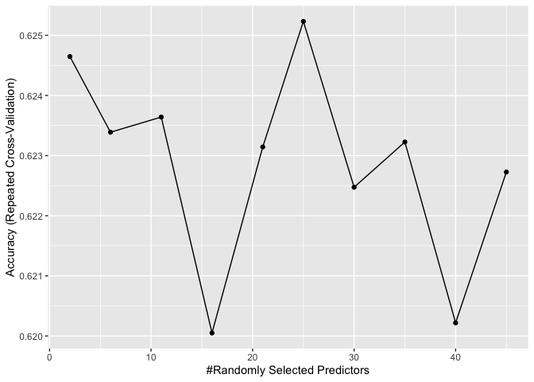

Analysis
================
Robert West
7/2/2020

# FRIDAY Report

## About the Data

The Dataset contains information about articles posted on
[Mashable](https://mashable.com/) that includes measures of sentiment
analysis. Being absolutely no expert in language analysis, I will need
to explore the data before modelling.

``` r
data_Total = read_csv("OnlineNewsPopularity.csv")
```

Upon review of the data, there are variables that I elected to not
consider for the analysis:

  - `url`  
  - `timedelta`  
  - `Closeness to LDA 0`
  - `Closeness to LDA 1`  
  - `Closeness to LDA 2`  
  - `Closeness to LDA 3`  
  - `Closeness to LDA 4`

URL and timedelta are listed as non-predicting in the dataset, and the
LDA variables are unclear in nature, but I believe they are related to a
natural language processing tool called [Latent Dirichlet
allocation](https://en.wikipedia.org/wiki/Latent_Dirichlet_allocation).
Without knowledge of this type of analysis, I felt uncomfortable
including these variables in my own.

``` r
data_Analysis = data_Total %>%
  dplyr::select(-c(url, timedelta, LDA_00, LDA_01, LDA_02, LDA_03, LDA_04)) %>%
  mutate(
    monday = weekday_is_monday,
    tuesday = weekday_is_tuesday,
    wednesday = weekday_is_wednesday,
    thursday = weekday_is_thursday,
    friday = weekday_is_friday,
    saturday = weekday_is_saturday,
    sunday = weekday_is_sunday,
    .keep = "unused"
  )
```

## Analysis Goals

Overall, the goal of this analysis is to predict the `shares` variable
for each article. While this may be important, I find it more
interesting to attempt to classify a given article as high volume (More
than 1400 shares) or low volume (At most 1400 shares) based on the
variables that we are given. I think this will give us higher predictive
power because models that are built solely on numeric data tend to give
larger errors in extreme cases of only a handful of shares and thousands
of shares. Additionally, we practically care less about the actual
number of shares that a post receives and more about its magnitude. This
analysis will be done for every day of the
week.

``` r
data_Analysis$shares_cat = ifelse(data_Analysis$shares >= 1400, "High", "Low")

#Filter by the day
data_Day = data_Analysis %>% 
  filter(data_Analysis[params$day] == 1) %>%
  mutate(shares_cat = as.factor(shares_cat))
```

## Train/Test split

Since there is a plethora of data for every day, I will do a 70:30 split
for training/testing respectively.

``` r
set.seed(623)
train = sample(1:nrow(data_Day), size = 0.7*nrow(data_Day))
test = dplyr::setdiff(1:nrow(data_Day), train)

data_Train = data_Day[train, ]
data_Test = data_Day[test, ]
```

## Data Exploration

``` r
ggplot(data=data_Train, aes(x=n_tokens_title, y=n_tokens_content))+
  geom_jitter(aes(color=shares_cat))+
  labs(x="Title Characters", y="Content Characters", color="Share Volume", title="Title Vs Content in Characters")
```

<!-- -->

``` r
ggplot(data=data_Train, aes(x=rate_positive_words, y=global_rate_positive_words))+
  geom_jitter(aes(color=shares_cat))+
  labs(x="Rate of Positive Words", y="Global Rate of Positive Words", color="Share Volume", title="Individual vs Global Positive Word Rate")
```

<!-- -->

``` r
ggplot(data=data_Train, aes(x=rate_negative_words, y=global_rate_negative_words))+
  geom_jitter(aes(color=shares_cat))+
  labs(x="Rate of Negative Words", y="Global Rate of Negative Words", color="Share Volume", title="Individual vs Global Negative Word Rate")
```

<!-- -->

``` r
ggplot(data=data_Train, aes(x=global_subjectivity, y=global_sentiment_polarity))+
  geom_jitter(aes(color = shares_cat))+
  labs(x="Global Subjectivity", y="Global Sentiment", title="Subjectivity Against Sentiment", color = "Share Volume")
```

<!-- -->

``` r
ggplot(data=data_Train, aes(x=shares_cat, y=n_tokens_title))+
  geom_boxplot(aes(color=shares_cat))+
  labs(y="Title Characters", x="Shares Volume", color="Shares Volume")
```

<!-- -->

``` r
ggplot(data=data_Train, aes(x=avg_positive_polarity, y=avg_negative_polarity))+
  geom_jitter(aes(color=shares_cat))+
  labs(x="Average Positive Polarity", y="Average Negative Polarity", color="Shares Volume", title="Average Positive vs Negative Polarity")
```

<!-- -->

To attempt to predict the relative popularity of a post, I will utilize
Logistic regression as a GLM and a random forest fit and tuned on a
training set and evaluated on a test set using misclassification rate as
the metric for selecting a better fitting model.

First, I need to grab the numeric variables from the training set

``` r
train_Num = data_Train %>%
  dplyr::select(-c(is_weekend,
            monday,
            tuesday,
            wednesday,
            thursday,
            friday,
            saturday,
            sunday,
            shares))

test_Num = data_Test %>%
  dplyr::select(-c(is_weekend,
            monday,
            tuesday,
            wednesday,
            thursday,
            friday,
            saturday,
            sunday,
            shares))
```

## Fitting a Logistic Regression Model to the training set

Below, I fit the Logistic model using the `glm()` function and selected
a “best” model by forward select with AIC as the criteria. This is done
with AIC to attempt to allow the model to generalize better by finding a
balance between how well it explains the data and how complex it is.

``` r
library(MASS)

logistic_Fit = glm(shares_cat ~ ., data=train_Num, family="binomial") %>%
  stepAIC(direction = "forward", trace=FALSE, steps=100)
```

## Fitting a Random Forest to the training set

I utilized a Random Forest for my ensemble method. This was preferable
to me because I like that it chooses a subset of the predictors and
Bootstraps the data to get better prediction by aggregating across many
trees. The number of variables to use in the model is selected by 5 fold
repeated cross validation using the `caret` package.

``` r
trctrl = trainControl(method="repeatedcv", number=5, repeats = 3)

rf_Fit = train(shares_cat ~ ., data=train_Num, method="rf",
              trControl = trctrl,
              preProcess = c("center", "scale"),
              tuneLength = 10,
              ntree = 20)
rf_Fit
```

    ## Random Forest 
    ## 
    ## 3990 samples
    ##   45 predictor
    ##    2 classes: 'High', 'Low' 
    ## 
    ## Pre-processing: centered (45), scaled (45) 
    ## Resampling: Cross-Validated (5 fold, repeated 3 times) 
    ## Summary of sample sizes: 3192, 3192, 3192, 3191, 3193, 3193, ... 
    ## Resampling results across tuning parameters:
    ## 
    ##   mtry  Accuracy   Kappa    
    ##    2    0.6246470  0.2296932
    ##    6    0.6233887  0.2285341
    ##   11    0.6236409  0.2303570
    ##   16    0.6200492  0.2227157
    ##   21    0.6231433  0.2304866
    ##   25    0.6252320  0.2336101
    ##   30    0.6224736  0.2291272
    ##   35    0.6232259  0.2304336
    ##   40    0.6202184  0.2240973
    ##   45    0.6227266  0.2310848
    ## 
    ## Accuracy was used to select the optimal model using the largest value.
    ## The final value used for the model was mtry = 25.

``` r
ggplot(data=rf_Fit)
```

<!-- -->

## K-Nearest-Neighbors

Out of curiosity, since our data is primarily numeric, I wanted to fit a
KNN model as well to see how well it stacks against our linear model and
ensemble model. This is all done using the `caret` package.

``` r
trctrl = trainControl(method="repeatedcv", number=5, repeats=3)

knn_Fit = train(shares_cat ~., data=train_Num, method="knn",
                trControl = trctrl,
                preProcess = c("center", "scale"),
                tuneLength = 10)
knn_Fit
```

    ## k-Nearest Neighbors 
    ## 
    ## 3990 samples
    ##   45 predictor
    ##    2 classes: 'High', 'Low' 
    ## 
    ## Pre-processing: centered (45), scaled (45) 
    ## Resampling: Cross-Validated (5 fold, repeated 3 times) 
    ## Summary of sample sizes: 3192, 3192, 3191, 3193, 3192, 3193, ... 
    ## Resampling results across tuning parameters:
    ## 
    ##   k   Accuracy   Kappa    
    ##    5  0.5963230  0.1843156
    ##    7  0.6011678  0.1942536
    ##    9  0.6050940  0.2019503
    ##   11  0.6064311  0.2052294
    ##   13  0.6079359  0.2080510
    ##   15  0.6063495  0.2040872
    ##   17  0.6102768  0.2115711
    ##   19  0.6142854  0.2205807
    ##   21  0.6152032  0.2219259
    ##   23  0.6192983  0.2299157
    ## 
    ## Accuracy was used to select the optimal model using the largest value.
    ## The final value used for the model was k = 23.

``` r
ggplot(data=knn_Fit)
```

<!-- -->

## Comparing Out-Of-Sample Misclassification Rate

``` r
logistic_Pred = predict(logistic_Fit, type = "response", newdata = test_Num)
logistic_Pred_Class = ifelse(logistic_Pred > 0.5, "High", "Low")
logistic_MisClass = mean(logistic_Pred_Class != data_Test$shares_cat)

rf_Pred = predict(rf_Fit, newdata = test_Num)
rf_MisClass = mean(rf_Pred != test_Num$shares_cat)

knn_Pred = predict(knn_Fit, newdata = test_Num)
knn_MisClass = mean(knn_Pred != test_Num$shares_cat)

kable(data.frame(Logistic = logistic_MisClass, RF = rf_MisClass, KNN = knn_MisClass), caption = "MisClassification Rate")
```

|  Logistic |        RF |       KNN |
| --------: | --------: | --------: |
| 0.6458212 | 0.3746347 | 0.3530099 |

MisClassification Rate
