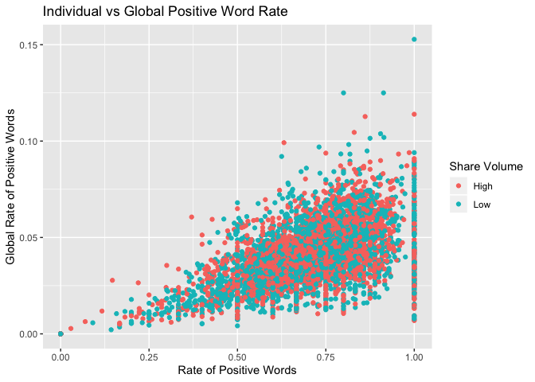
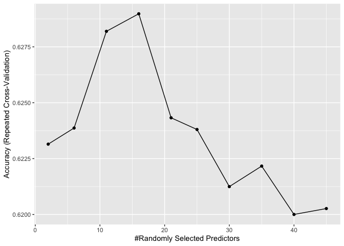

Analysis
================
Robert West
7/2/2020

# THURSDAY Report

## About the Data

The Dataset contains information about articles posted on
[Mashable](https://mashable.com/) that includes measures of sentiment
analysis. Being absolutely no expert in language analysis, I will need
to explore the data before modelling.

``` r
data_Total = read_csv("OnlineNewsPopularity.csv")
```

Upon review of the data, there are variables that I elected to not
consider for the analysis:

  - `url` (Described as non-predictive)  
  - `timedelta` (Described as non-predictive)  
  - `Closeness to LDA 0`
  - `Closeness to LDA 1`  
  - `Closeness to LDA 2`  
  - `Closeness to LDA 3`  
  - `Closeness to LDA 4`

URL and timedelta are listed as non-predicting in the dataset, and the
LDA variables are unclear in nature, but I believe they are related to a
natural language processing tool called [Latent Dirichlet
allocation](https://en.wikipedia.org/wiki/Latent_Dirichlet_allocation).
Without knowledge of this type of analysis, I felt uncomfortable
including these variables in my own.

``` r
data_Analysis = data_Total %>%
  dplyr::select(-c(url, timedelta, LDA_00, LDA_01, LDA_02, LDA_03, LDA_04)) %>%
  mutate(
    monday = weekday_is_monday,
    tuesday = weekday_is_tuesday,
    wednesday = weekday_is_wednesday,
    thursday = weekday_is_thursday,
    friday = weekday_is_friday,
    saturday = weekday_is_saturday,
    sunday = weekday_is_sunday,
    .keep = "unused"
  )
```

## Analysis Goals

Overall, the goal of this analysis is to predict the `shares` variable
for each article. While this may be important, I find it more
interesting to attempt to classify a given article as high volume (More
than 1400 shares) or low volume (At most 1400 shares) based on the
variables that we are given. I think this will give us higher predictive
power because models that are built solely on numeric data tend to give
larger errors in extreme cases of only a handful of shares and thousands
of shares. Additionally, we practically care less about the actual
number of shares that a post receives and more about its magnitude. This
analysis will be done for every day of the
week.

``` r
data_Analysis$shares_cat = ifelse(data_Analysis$shares >= 1400, "High", "Low")

#Filter by the day
data_Day = data_Analysis %>% 
  filter(data_Analysis[params$day] == 1) %>%
  mutate(shares_cat = as.factor(shares_cat))
```

## Train/Test split

Since there is a plethora of data for every day, I will do a 70:30 split
for training/testing respectively.

``` r
set.seed(623)
train = sample(1:nrow(data_Day), size = 0.7*nrow(data_Day))
test = dplyr::setdiff(1:nrow(data_Day), train)

data_Train = data_Day[train, ]
data_Test = data_Day[test, ]
```

## Data Summary

``` r
grouped_mean = data_Train %>%
  group_by(shares_cat) %>%
  summarise(
    n=n(),
    avg_Title_Char = round(mean(n_tokens_title), 3),
    avg_Content_Char = round(mean(n_tokens_content), 3),
    avg_hrefs = round(mean(num_hrefs), 3),
    avg_media = round(mean(num_imgs + num_videos), 3),
    avg_subjectivity = round(mean(global_subjectivity), 3), 
    avg_positive = round(mean(rate_positive_words), 3),
    avg_negative = round(mean(rate_negative_words), 3),
    avg_shares = round(mean(shares), 3)
  )
  
kable(grouped_mean, caption="Averages for each level of share volume")
```

| shares\_cat |    n | avg\_Title\_Char | avg\_Content\_Char | avg\_hrefs | avg\_media | avg\_subjectivity | avg\_positive | avg\_negative | avg\_shares |
| :---------- | ---: | ---------------: | -----------------: | ---------: | ---------: | ----------------: | ------------: | ------------: | ----------: |
| High        | 2556 |           10.250 |            545.136 |     11.556 |      6.210 |             0.451 |         0.687 |         0.279 |    5411.972 |
| Low         | 2530 |           10.426 |            535.689 |      9.901 |      5.161 |             0.439 |         0.679 |         0.298 |     894.638 |

Averages for each level of share volume

``` r
grouped_sd = data_Train %>%
  group_by(shares_cat) %>%
  summarise(
    n=n(),
    sd_Title_Char = round(sd(n_tokens_title), 3),
    sd_Content_Char = round(sd(n_tokens_content), 3),
    sd_hrefs = round(sd(num_hrefs), 3),
    sd_media = round(sd(num_imgs + num_videos), 3),
    sd_subjectivity = round(sd(global_subjectivity), 3), 
    sd_positive = round(sd(rate_positive_words), 3),
    sd_negative = round(sd(rate_negative_words), 3),
    sd_shares = round(sd(shares), 3)
  )

kable(grouped_sd, caption="Standard Deviations for each level of share volume")
```

| shares\_cat |    n | sd\_Title\_Char | sd\_Content\_Char | sd\_hrefs | sd\_media | sd\_subjectivity | sd\_positive | sd\_negative | sd\_shares |
| :---------- | ---: | --------------: | ----------------: | --------: | --------: | ---------------: | -----------: | -----------: | ---------: |
| High        | 2556 |           2.166 |           483.724 |    12.041 |     8.563 |            0.121 |        0.195 |        0.154 |  12884.175 |
| Low         | 2530 |           2.101 |           445.801 |    10.190 |     8.466 |            0.109 |        0.186 |        0.161 |    250.827 |

Standard Deviations for each level of share volume

From the table above, it doesn’t seem like center and spread of the
levels of share volume differ too much in any variable that I
considered. This may make modeling and predicting a little harder
because the algorithm will have small differences to detect between the
two categories.

## Visual Exploration

I am unfamiliar with many variables in the dataset. Below are multiple
plots of variables such as the number of characters and tools for
sentiment analysis such as positive/negative word rate. In each plot, I
try to get a feel for the relationship of the share volume to each of
the variables.

``` r
ggplot(data=data_Train, aes(x=n_tokens_title, y=n_tokens_content))+
  geom_jitter(aes(color=shares_cat))+
  labs(x="Title Characters", y="Content Characters", color="Share Volume", title="Title Vs Content in Characters")
```

<!-- -->

``` r
ggplot(data=data_Train, aes(x=rate_positive_words, y=global_rate_positive_words))+
  geom_jitter(aes(color=shares_cat))+
  labs(x="Rate of Positive Words", y="Global Rate of Positive Words", color="Share Volume", title="Individual vs Global Positive Word Rate")
```

<!-- -->

``` r
ggplot(data=data_Train, aes(x=rate_negative_words, y=global_rate_negative_words))+
  geom_jitter(aes(color=shares_cat))+
  labs(x="Rate of Negative Words", y="Global Rate of Negative Words", color="Share Volume", title="Individual vs Global Negative Word Rate")
```

<!-- -->

``` r
ggplot(data=data_Train, aes(x=global_subjectivity, y=global_sentiment_polarity))+
  geom_jitter(aes(color = shares_cat))+
  labs(x="Global Subjectivity", y="Global Sentiment", title="Subjectivity Against Sentiment", color = "Share Volume")
```

<!-- -->

``` r
ggplot(data=data_Train, aes(x=shares_cat, y=n_tokens_title))+
  geom_boxplot(aes(color=shares_cat))+
  labs(y="Title Characters", x="Shares Volume", color="Shares Volume")
```

<!-- -->

``` r
ggplot(data=data_Train, aes(x=avg_positive_polarity, y=avg_negative_polarity))+
  geom_jitter(aes(color=shares_cat))+
  labs(x="Average Positive Polarity", y="Average Negative Polarity", color="Shares Volume", title="Average Positive vs Negative Polarity")
```

<!-- -->

As a whole, these plots do not suggest that there is a huge difference
in behavior among high share volume and low share volume articles. This
reinforces my assumption that I may see some large misclassification
rates in my models.

## Models

To attempt to predict the relative popularity of a post, I will utilize
Logistic regression as a GLM and a random forest fit and tuned on a
training set and evaluated on a test set using misclassification rate as
the metric for selecting a better fitting model.

First, I need to grab the numeric variables from the training set:

``` r
train_Num = data_Train %>%
  dplyr::select(-c(is_weekend,
            monday,
            tuesday,
            wednesday,
            thursday,
            friday,
            saturday,
            sunday,
            shares))

test_Num = data_Test %>%
  dplyr::select(-c(is_weekend,
            monday,
            tuesday,
            wednesday,
            thursday,
            friday,
            saturday,
            sunday,
            shares))
```

## Fitting a Logistic Regression Model to the training set

Below, I fit the Logistic model using the `glm()` function and selected
a “best” model by forward select with AIC as the criteria. This is done
with AIC to attempt to allow the model to generalize better by finding a
balance between how well it explains the data and how complex it is.

``` r
library(MASS)

logistic_Fit = glm(shares_cat ~ ., data=train_Num, family="binomial") %>%
  stepAIC(direction = "forward", trace=FALSE, steps=100)
```

## Fitting a Random Forest to the training set

I utilized a Random Forest for my ensemble method. This was preferable
to me because I like that it chooses a subset of the predictors and
Bootstraps the data to get better prediction by aggregating across many
trees. The number of variables to use in the model is selected by 5 fold
repeated cross validation using the `caret` package with accuracy as the
metric.

``` r
trctrl = trainControl(method="repeatedcv", number=5, repeats = 3)

rf_Fit = train(shares_cat ~ ., data=train_Num, method="rf",
              trControl = trctrl,
              preProcess = c("center", "scale"),
              tuneLength = 10,
              ntree = 20)
rf_Fit
```

    ## Random Forest 
    ## 
    ## 5086 samples
    ##   45 predictor
    ##    2 classes: 'High', 'Low' 
    ## 
    ## Pre-processing: centered (45), scaled (45) 
    ## Resampling: Cross-Validated (5 fold, repeated 3 times) 
    ## Summary of sample sizes: 4069, 4069, 4068, 4069, 4069, 4068, ... 
    ## Resampling results across tuning parameters:
    ## 
    ##   mtry  Accuracy   Kappa    
    ##    2    0.6231468  0.2460812
    ##    6    0.6238691  0.2475423
    ##   11    0.6281949  0.2562016
    ##   16    0.6289798  0.2577876
    ##   21    0.6243261  0.2484507
    ##   25    0.6238032  0.2474307
    ##   30    0.6212472  0.2422746
    ##   35    0.6221654  0.2440988
    ##   40    0.6200018  0.2398466
    ##   45    0.6202657  0.2403599
    ## 
    ## Accuracy was used to select the optimal model using the largest value.
    ## The final value used for the model was mtry = 16.

``` r
ggplot(data=rf_Fit)
```

<!-- -->

## Fitting a K-Nearest-Neighbors model to the training set

Out of curiosity, since our data is primarily numeric, I wanted to fit a
KNN model as well to see how well it stacks against my linear model and
ensemble model. This is all done using the `caret` package. The best `k`
to use was selected by using repeated 5 fold cross validation with
accuracy as the metric.

``` r
trctrl = trainControl(method="repeatedcv", number=5, repeats=3)

knn_Fit = train(shares_cat ~., data=train_Num, method="knn",
                trControl = trctrl,
                preProcess = c("center", "scale"),
                tuneLength = 10)
knn_Fit
```

    ## k-Nearest Neighbors 
    ## 
    ## 5086 samples
    ##   45 predictor
    ##    2 classes: 'High', 'Low' 
    ## 
    ## Pre-processing: centered (45), scaled (45) 
    ## Resampling: Cross-Validated (5 fold, repeated 3 times) 
    ## Summary of sample sizes: 4069, 4069, 4069, 4068, 4069, 4069, ... 
    ## Resampling results across tuning parameters:
    ## 
    ##   k   Accuracy   Kappa    
    ##    5  0.5912311  0.1827918
    ##    7  0.5981775  0.1967327
    ##    9  0.6053219  0.2110037
    ##   11  0.6080734  0.2165310
    ##   13  0.6115478  0.2234926
    ##   15  0.6113510  0.2231006
    ##   17  0.6092535  0.2189086
    ##   19  0.6053215  0.2110587
    ##   21  0.6072225  0.2148662
    ##   23  0.6061747  0.2127862
    ## 
    ## Accuracy was used to select the optimal model using the largest value.
    ## The final value used for the model was k = 13.

``` r
ggplot(data=knn_Fit)
```

<!-- -->

## Comparing Test Misclassification Rate

The metric that I use to compare models is their misclassification rate
on the test set. I could normally not get a training set below 20%
misclassification, so I imagine that these will be a good bit higher on
data that the model has not seen
before.

``` r
logistic_Pred = predict(logistic_Fit, type = "response", newdata = test_Num)
logistic_Pred_Class = ifelse(logistic_Pred > 0.5, "High", "Low")
logistic_Misclass = mean(logistic_Pred_Class != data_Test$shares_cat)

rf_Pred = predict(rf_Fit, newdata = test_Num)
rf_Misclass = mean(rf_Pred != test_Num$shares_cat)

knn_Pred = predict(knn_Fit, newdata = test_Num)
knn_Misclass = mean(knn_Pred != test_Num$shares_cat)

kable(data.frame(Logistic = logistic_Misclass, RF = rf_Misclass, KNN = knn_Misclass), caption = "MisClassification Rate")
```

| Logistic |        RF |      KNN |
| -------: | --------: | -------: |
| 0.650619 | 0.3846859 | 0.387437 |

MisClassification Rate

## Conclusion

For this day, of the models that we fit, the best test misclassification
rate was 38.5%. Logistic Regression tended to perform very weakly to the
other model. With a misclassification rate of 65.0618982%, we would be
better off always predicting one class since the counts of high and low
volume of shares is relatively similar. KNN usually tended to be a
better classifier, but since it was out of bounds for the project, the
clear winner for predicting share volume is the Random Forest model.
